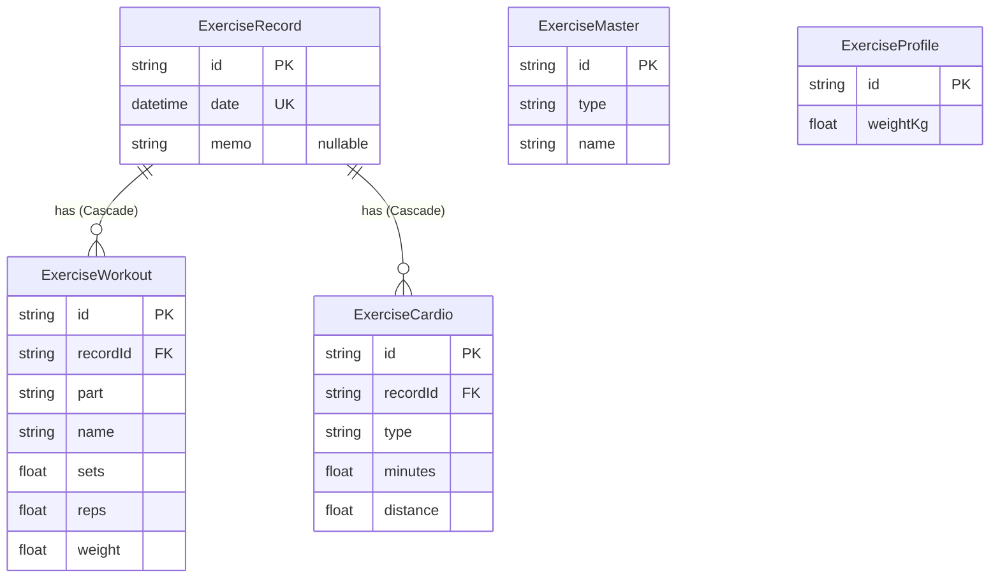

# 05 データ仕様書（Data Specification）

データモデル・ERD・DB スキーマ・データフローを定義する。スキーマの実体は `front/prisma/schema.prisma`。

> 本アプリが使用するのは `Exercise*` 系モデルのみ。同 schema 内の `Report` / `ReportTag` / `ReportTagMapping` / `VideoEntry` は本アプリ対象外（共有スキーマの名残）。

## データモデル

| エンティティ | 説明 |
|--------------|------|
| `ExerciseRecord` | 1 日 1 レコード（日付ユニーク）。体調メモを持つ |
| `ExerciseWorkout` | 筋トレ行（部位・種目・セット・回数・重量）。Record に複数紐付く |
| `ExerciseCardio` | 有酸素行（種別・時間・距離）。Record に複数紐付く |
| `ExerciseMaster` | マスター（type=部位/種目/有酸素種別、name）。type+name でユニーク |
| `ExerciseProfile` | プロフィール（体重 kg）。1 件のみ維持 |

## ER 図（テーブル関係）

`ExerciseMaster`（type+name でユニーク）と `ExerciseProfile`（1 件のみ維持）はリレーションを持たない独立テーブル。

## テーブルスキーマ

### ExerciseRecord

| カラム | 型 | 制約 |
|--------|----|----|
| id | String | `@id @default(cuid())` |
| date | DateTime | `@unique`（1 日 1 レコード）, index |
| memo | String? | 体調メモ（任意、500 文字想定） |
| createdAt / updatedAt | DateTime | 監査用 |

### ExerciseWorkout

| カラム | 型 | 制約 |
|--------|----|----|
| id | String | `@id @default(cuid())` |
| recordId | String | FK → ExerciseRecord（Cascade）, index |
| part / name | String | 部位 / 種目名 |
| sets / reps / weight | Float | セット数 / 回数 / 重量（小数可、kg） |

### ExerciseCardio

| カラム | 型 | 制約 |
|--------|----|----|
| id | String | `@id @default(cuid())` |
| recordId | String | FK → ExerciseRecord（Cascade）, index |
| type | String | 種別（ラン/ウォーク） |
| minutes / distance | Float | 時間（分） / 距離（km） |

### ExerciseMaster

| カラム | 型 | 制約 |
|--------|----|----|
| id | String | `@id @default(cuid())` |
| type | String | 部位 / 種目 / 有酸素種別, index |
| name | String | 名称, index |
| — | — | `@@unique([type, name])` |

### ExerciseProfile

| カラム | 型 | 制約 |
|--------|----|----|
| id | String | `@id @default(cuid())` |
| weightKg | Float | 体重（kg） |

## データフロー

- 記録追加（POST `/records`）→ ExerciseRecord + 紐付く Workout/Cardio を作成（同日存在時はエラー）。
- 一覧（GET `/records`）→ 日付降順・ページングで Record を集約取得（有酸素は `cardios` 配列）。
- 詳細（GET `/records/:date`）→ Record + workouts + cardios を返却。
- カロリーは保存値ではなく表示時に算定（[`03-functional-specification.md`](./03-functional-specification.md) 参照）。
- API 詳細は [`07-api-specification.md`](./07-api-specification.md)。

## マイグレーション

- `front/prisma/migrations/` に SQL を配置（例: `20260321_cardio_multiple_rows`, `20260322_exercise_rls_policies`）。
- `pnpm run build` は `prisma generate` のみ実行。マイグレーションは自動適用されないため、デプロイ前に Supabase SQL Editor または `psql $DATABASE_URL -f <migration.sql>` で手動適用する。
- RLS ポリシーの方針は [`06-security-specification.md`](./06-security-specification.md) を参照。
