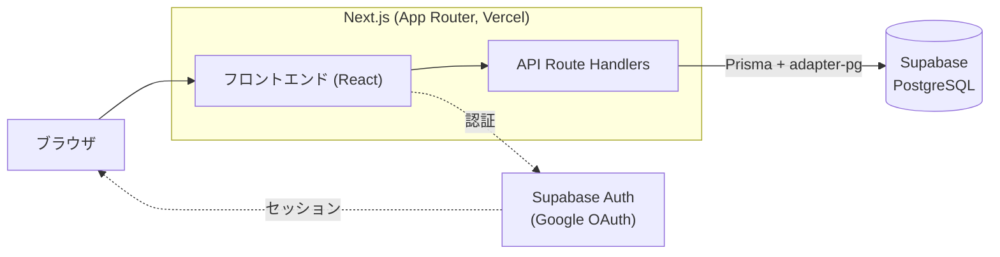

# 09 アーキテクチャ仕様書（Architecture Specification）

システム構成・技術スタック・インフラ・デプロイ方針を定義する。

## 目次

- [システム構成](#システム構成)
- [技術スタック](#技術スタック)
- [インフラ構成](#インフラ構成)
- [環境変数](#環境変数)
- [デプロイ方針](#デプロイ方針)
- [CI/CD パイプライン](#cicd-パイプライン)
  - [CI 固有の設定](#ci-固有の設定)
  - [構築時のトラブルシューティング記録](#構築時のトラブルシューティング記録)

## システム構成

- フロントエンド + API（Route Handlers）を Next.js（App Router）で構築し、Vercel にデプロイ。
- データストアは Supabase（PostgreSQL）。Prisma（`@prisma/adapter-pg` + `pg`）で接続。
- 認証は Supabase Google OAuth（[`06-security-specification.md`](./06-security-specification.md)）。

## 技術スタック

| 区分 | 採用 |
|------|------|
| フレームワーク | Next.js 16.1.6（App Router, Turbopack）/ React 19.2 |
| 言語 | TypeScript 5 |
| スタイリング | Tailwind CSS v4 / lucide-react |
| ORM | Prisma v6（`@prisma/client`, `@prisma/adapter-pg`, `pg`） |
| DB / 認証 | Supabase（PostgreSQL / Google OAuth） |
| パッケージ管理 | pnpm（workspace: `front/`） |
| テスト | Vitest 4 / Playwright（[`08-test-specification.md`](./08-test-specification.md)） |

## インフラ構成

- ホスティング: Vercel（デプロイ対象は `front/`）。
- `front/vercel.json` の `ignoreCommand` で `front/` 差分がない場合はビルドを中止（base/docs 変更時の無駄なデプロイを抑止、Issue #10）。

## 環境変数

| 変数 | 用途 |
|------|------|
| `NEXT_PUBLIC_SUPABASE_URL` | Supabase クライアント初期化 |
| `NEXT_PUBLIC_SUPABASE_ANON_KEY` | Supabase クライアント初期化 |
| `NEXT_PUBLIC_SITE_URL` | サイト URL |
| `DATABASE_URL` | Prisma 接続文字列（未設定時は API がフォールバック） |
| `ADMIN_EMAIL` | 管理者判定（[`06-security-specification.md`](./06-security-specification.md)） |

## デプロイ方針

- `main` ブランチから本番反映。GitHub Flow（`.claude/rules/git.md`）。
- `pnpm run build` は `prisma generate && next build`。マイグレーションは自動適用されない（[`05-data-specification.md`](./05-data-specification.md)）。

## CI/CD パイプライン

GitHub Actions による自動検査。PR 作成時および `main` への push 時に、静的検査・Vitest・Playwright を実行。

- ファイル: `.github/workflows/test.yml`。
- トリガー: `push`→`main` / `pull_request`、いずれも `front/**` / `.github/workflows/**` の変更。
- ジョブ（並列実行）:

  | ジョブ | 内容 | 所要時間目安 |
  |--------|------|------------|
  | `static-check` | ESLint（`pnpm lint`）→ 型チェック（`tsc --noEmit`）→ 本番ビルド（`next build`） | ~1 分 |
  | `unit-test` | Vitest ユニットテスト | ~30 秒 |
  | `e2e-test` | Playwright E2E テスト | ~7 分 |

### CI 固有の設定

1. **Prisma クライアント生成**: `pnpm exec prisma generate`。未生成だと `@/generated/prisma/client` の Module not found → `static-check` の型チェック失敗、および E2E で Next.js Dev Overlay が画面を覆いテスト操作をブロックする。`static-check` は lint/型チェック/ビルドの前に生成する。
2. **`.env.local` の動的生成**: `E2E_BYPASS=1` / `NEXT_PUBLIC_SUPABASE_URL` / `NEXT_PUBLIC_SUPABASE_ANON_KEY` / `DATABASE_URL`（いずれもダミー）。
3. **Playwright タイムアウト**: テスト 60 秒（ローカル 30 秒）、webServer 起動 120 秒（CI はオンデマンドコンパイルで初回が遅いため）。

### 構築時のトラブルシューティング記録

- **Next.js Dev Overlay によるクリックブロック**: `prisma generate` 未実行が原因 → CI に生成ステップを追加。
- **Supabase クライアント初期化エラー（`supabaseUrl is required`）**: `NEXT_PUBLIC_SUPABASE_URL` 未設定が原因 → `.env.local` にダミー URL を設定。
- **`NEXT_PUBLIC_*` のクライアントバンドル展開**: シェル環境変数の継承では不十分な場合がある → `.env.local` で確実に設定し、`isBypassAllowed` を `NODE_ENV !== 'production'` のみに簡素化。

※ Vercel ビルドエラーの詳細時系列は [`docs/error-reports/2026-02-04-vercel-build-errors.md`](./error-reports/2026-02-04-vercel-build-errors.md) を参照。
