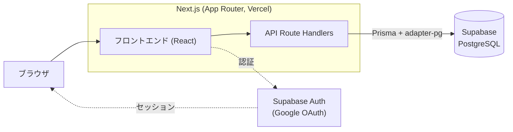

# 09 アーキテクチャ仕様書（Architecture Specification）

システム構成・技術スタック・インフラ・デプロイ方針を定義する。

## 目次

- [システム構成](#システム構成)
- [技術スタック](#技術スタック)
- [インフラ構成](#インフラ構成)
- [環境変数](#環境変数)
- [デプロイ方針](#デプロイ方針)
- [CI/CD パイプライン](#cicd-パイプライン)
  - [CI 固有の設定](#ci-固有の設定)
  - [構築時のトラブルシューティング記録](#構築時のトラブルシューティング記録)

## システム構成

- フロントエンド + API（Route Handlers）を Next.js（App Router）で構築し、Vercel にデプロイ。
- データストアは Supabase（PostgreSQL）。Prisma（`@prisma/adapter-pg` + `pg`）で接続。
- 認証は Supabase Google OAuth（[`06-security-specification.md`](./06-security-specification.md)）。

```mermaid
flowchart LR
    Browser["ブラウザ"]
    subgraph Vercel["Next.js (App Router, Vercel)"]
        UI["フロントエンド (React)"]
        API["API Route Handlers"]
    end
    Auth["Supabase Auth<br/>(Google OAuth)"]
    DB[("Supabase<br/>PostgreSQL")]

    Browser --> UI
    UI --> API
    UI -.認証.-> Auth
    API -->|Prisma + adapter-pg| DB
    Auth -.セッション.-> Browser
```

### フロントのデータアクセス

画面から API への呼び出しは `components/` → `hooks/` → `repositories/` の一方向に限る（`.claude/rules/frontend.md`「レイヤ依存の一方向ルール」）。

| 層 | 役割 | 実装（records: #142 / masters・profile・admin: #143） |
|---|---|---|
| `components/` | 描画・画面遷移・表示文言 | `RecordsListClient` / `AdminRecordsListClient` / `RecordDetailClient` / `AdminRecordNewClient` / `AdminRecordEditClient` / `AdminMastersClient` / `AdminProfileClient` / `CalorieEstimate` |
| `hooks/` | 取得状態の管理・フォーム値 → API 本文の変換 | `useRecordList` / `useRecordDetail` / `useRecordMutations`、記録フォームの選択肢は `useMasters`（#6）、前回の記録のコピーは `useLatestRecord`（#26）、マスター管理は `useMasterList`、体重は `useProfile`（プロフィール画面・推定消費カロリーで共用）、管理者判定は `useAdminSession` |
| `repositories/` | `fetch` / `authFetch` の呼び出しと、結果の `ApiResult`（`{ ok, data } \| { ok: false, status }`）への詰め替え | `repositories/record.ts` / `master.ts` / `profile.ts` / `admin.ts`。失敗の詰め替えは `repositories/request.ts` に集約 |
| `types/` | API 契約型（Route Handler とフロントで共有） | `types/record.ts` / `types/master.ts` / `types/profile.ts` / `types/admin.ts` / `types/apiResult.ts` |

- repositories は例外を投げず、失敗を `status`（通信エラーは `0`）で返す。画面は `status` で分岐する（例: 409 = 同日重複）。
- `components/` / `hooks/` から `fetch` / `authFetch` を直接呼ぶ箇所はない（#143 で移行完了）。
- `repositories/admin.ts` の `fetchAdminMe` は `authFetch` を使わず、`useAdminSession` が認証状態の変化イベントで受け取ったトークンを明示的に渡す（`getSession()` を取り直すと、ログアウト直後などに別時点のトークンを拾い得るため）。

## 技術スタック

| 区分 | 採用 |
|------|------|
| フレームワーク | Next.js 16.3.8（App Router, Turbopack）/ React 19.2 |
| 言語 | TypeScript 5 |
| スタイリング | Tailwind CSS v4 / lucide-react |
| ORM | Prisma v6（`@prisma/client`, `@prisma/adapter-pg`, `pg`） |
| DB / 認証 | Supabase（PostgreSQL / Google OAuth） |
| パッケージ管理 | pnpm（workspace: `front/`） |
| テスト | Vitest 4 / Playwright（[`08-test-specification.md`](./08-test-specification.md)） |

## インフラ構成

- ホスティング: Vercel（デプロイ対象は `front/`）。
- `front/vercel.json` の `ignoreCommand` で `front/` 差分がない場合はビルドを中止（base/docs 変更時の無駄なデプロイを抑止、Issue #10）。

## 環境変数

| 変数 | 用途 |
|------|------|
| `NEXT_PUBLIC_SUPABASE_URL` | Supabase クライアント初期化 |
| `NEXT_PUBLIC_SUPABASE_ANON_KEY` | Supabase クライアント初期化 |
| `NEXT_PUBLIC_SITE_URL` | サイト URL |
| `DATABASE_URL` | Prisma 接続文字列（未設定時は API がフォールバック） |
| `ADMIN_EMAIL` | 管理者判定（[`06-security-specification.md`](./06-security-specification.md)） |

### 環境の分離

本番 DB を手元の既定の接続先にしない（`.claude/rules/production-data.md`）。用途ごとに接続先を分ける。

| 用途 | 接続先 | 設定場所 |
|------|--------|----------|
| ローカル開発・動作確認 | ローカル Supabase（`supabase start`。API `127.0.0.1:54321` / DB `127.0.0.1:54322`。設定は `front/supabase/config.toml`） | `front/.env` |
| IT | Testcontainers の PostgreSQL | `front/tests/setup/it-global-setup.ts` |
| E2E / シナリオ | `front/docker-compose.e2e.yml` の PostgreSQL（`localhost:5433`） | `TEST_DATABASE_URL`（既定値あり） |
| 本番 | Supabase 本番プロジェクト | Vercel の環境変数。手動マイグレーション用の接続情報は自動では読み込まれない `front/.env.prod` に `PROD_DATABASE_URL` などの別変数名で置く |

- `next dev` は `DATABASE_URL` がローカル（`localhost` / `127.0.0.1` / `::1`）以外を指していると起動を中断する（`front/next.config.ts` → `src/lib/localDatabaseUrl.ts`）。テスト DB のガードも同じ allowlist を使う。
- ローカル Supabase のスキーマは `pnpm run dev:db:push`（`prisma db push`）で `schema.prisma` から作る。`prisma/migrations/` は本番への差分 SQL のみで、初期スキーマを含まないため。RLS は Prisma（`postgres` ロール）がバイパスするため、ローカルでは適用しない。
- ローカル Supabase には Google OAuth を設定していない。管理画面の書き込みは `E2E_BYPASS=1` と「テストログイン」で行う。

## デプロイ方針

- `main` ブランチから本番反映。GitHub Flow（`.claude/rules/git.md`）。
- `pnpm run build` は `prisma generate && next build`。マイグレーションは自動適用されない（[`05-data-specification.md`](./05-data-specification.md)）。

## CI/CD パイプライン

GitHub Actions による自動検査。**変更内容に関係のあるジョブだけを動かす**ため、コード用とドキュメント用にワークフローを分離している（`.claude/rules/github-actions.md`）。

| ファイル | 対象 | トリガー |
|---|---|---|
| `.github/workflows/ci.yml` | コード（静的検査・Vitest・Playwright） | `push`→`main` / `pull_request`→`main`。`changes` ジョブでパス判定し、ドキュメントのみの変更では各ジョブを `if:` でスキップ |
| `.github/workflows/docs.yml` | ドキュメント（markdown lint・必須ファイル存在確認） | `push`→`main` / `pull_request`→`main`、いずれも `**/*.md` 等の変更時のみ |

- **パス判定は「除外リスト」方式**（`docs/**` / `**/*.md` / `.claude/**` 以外はコード変更とみなす）。許可リスト方式だと、新しいディレクトリが増えたときに黙ってテストが走らなくなるため。
- **`ci.yml` はワークフローレベルの `paths` を使わない**。必須チェック（ブランチ保護）に設定した場合、ワークフローが起動せずチェックが pending のまま PR がマージ不能になるため。ジョブレベル `if:` によるスキップは「skipped」＝成功扱いになる。
- 両ワークフローとも `concurrency`（連続 push で古い実行をキャンセル）と最小権限の `permissions: contents: read` を設定する。
- **action の版は Dependabot で追随する**（`.github/dependabot.yml`、`github-actions` を週次。#128）。手で一括置換せず、Dependabot が 1 本にまとめた更新 PR（`groups`）をレビューしてマージする（action ごとに分けると同じワークフローファイル上で互いに競合するため）。
- markdown lint の設定は `.markdownlint-cli2.jsonc`。見た目のルールは無効化し、**壊れているもの**（言語指定のないコードフェンス・空リンク・無効な見出しアンカー・表の前後空行）のみを検出する。

- `ci.yml` のジョブ（並列実行）:

  | ジョブ | 内容 | 所要時間目安 |
  |--------|------|------------|
  | `static-check` | フォーマット検証（`pnpm format` = `prettier --check`）→ ESLint（`pnpm lint`）→ 型チェック（`tsc --noEmit`）→ 本番ビルド（`next build`） | ~1 分 |
  | `unit-test` | Vitest ユニットテスト（モック） | ~30 秒 |
  | `it-test` | Vitest 統合テスト（Testcontainers の実 PostgreSQL、`pnpm test:it`） | ~1〜2 分 |
  | `e2e-test` | Playwright E2E テスト（単機能フロー、実 DB、`--project=e2e`） | ~7 分 |
  | `scenario-test` | Playwright シナリオテスト（複数機能横断、実 DB、`--project=scenario`） | ~2 分 |

### CI 固有の設定

1. **Prisma クライアント生成**: `pnpm exec prisma generate`。未生成だと `@/generated/prisma/client` の Module not found → `static-check` の型チェック失敗、および E2E で Next.js Dev Overlay が画面を覆いテスト操作をブロックする。`static-check` は lint/型チェック/ビルドの前に生成する。
2. **`.env.local` の動的生成（e2e-test）**: `E2E_BYPASS=1` / `NEXT_PUBLIC_SUPABASE_URL` / `NEXT_PUBLIC_SUPABASE_ANON_KEY` / `DATABASE_URL`（いずれもダミー）。
3. **`static-check` の build 用ダミー env**: `next build` は静的生成時に Supabase クライアントを初期化するため、`NEXT_PUBLIC_SUPABASE_URL` / `NEXT_PUBLIC_SUPABASE_ANON_KEY`（＋ `DATABASE_URL`）をダミー値で与える（未設定だと `supabaseUrl is required` でビルド失敗）。本番の実値は Vercel 側で設定。
6. **`e2e-test` の実 DB**: E2E は `front/docker-compose.e2e.yml` の PostgreSQL に対して実行する。CI は `pnpm run e2e:db:up`（`docker compose up -d --wait`）で DB を起動し、Playwright の `globalSetup` が `prisma db push` でスキーマを適用、webServer(dev) は `DATABASE_URL`（compose DB）で起動する。データは各テストの `beforeEach` で reset+seed。
4. **`it-test` の Node バージョン**: Testcontainers 12 が Node 22+ の API に依存するため、IT ジョブのみ Node 22 で実行する（他ジョブは Node 20）。
5. **Playwright タイムアウト**: テスト 60 秒（ローカル 30 秒）、webServer 起動 120 秒（CI はオンデマンドコンパイルで初回が遅いため）。

### 構築時のトラブルシューティング記録

- **Next.js Dev Overlay によるクリックブロック**: `prisma generate` 未実行が原因 → CI に生成ステップを追加。
- **Supabase クライアント初期化エラー（`supabaseUrl is required`）**: `NEXT_PUBLIC_SUPABASE_URL` 未設定が原因 → `.env.local` にダミー URL を設定。
- **`NEXT_PUBLIC_*` のクライアントバンドル展開**: シェル環境変数の継承では不十分な場合がある → `.env.local` で確実に設定し、`isBypassAllowed` を `NODE_ENV !== 'production'` のみに簡素化。

※ Vercel ビルドエラーの詳細時系列は [`docs/error-reports/2026-02-04-vercel-build-errors.md`](./error-reports/2026-02-04-vercel-build-errors.md) を参照。
